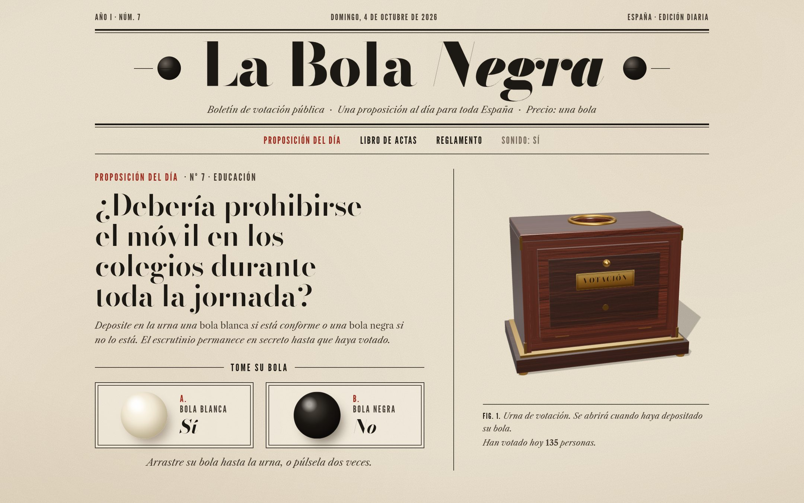
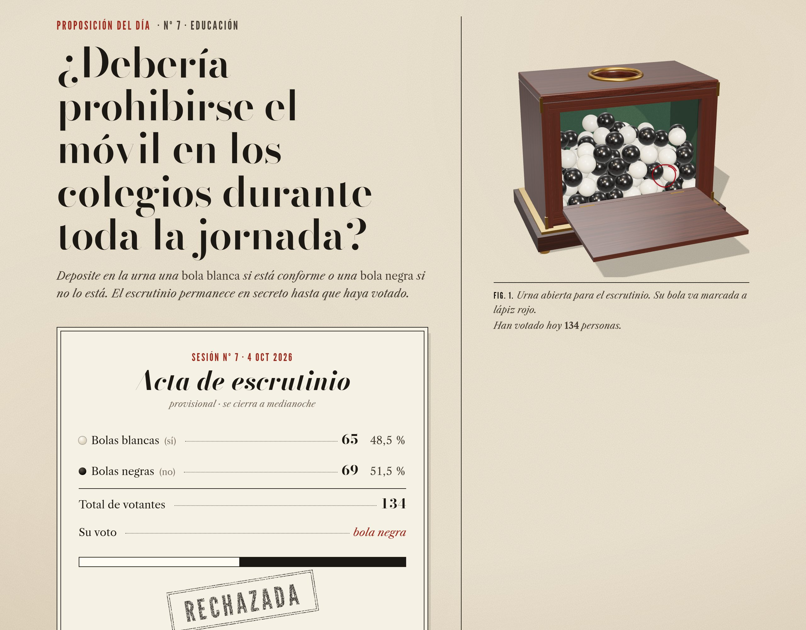
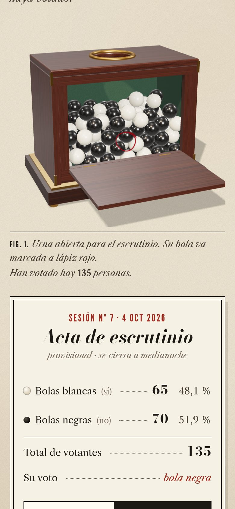
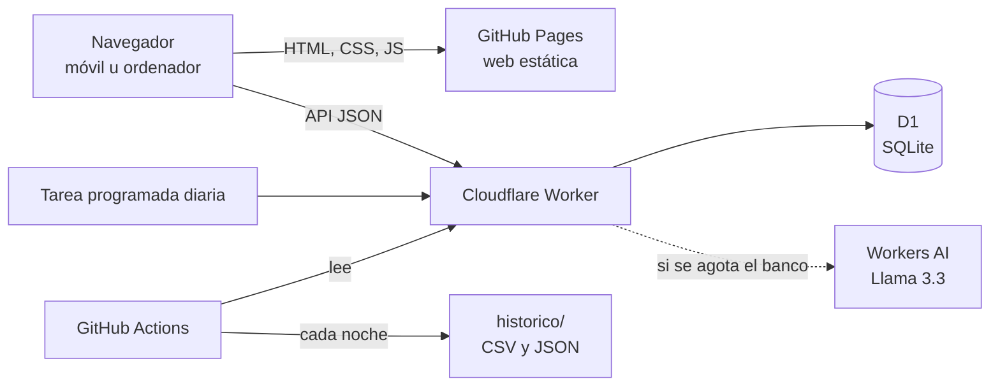

# La Bola Negra

**Una proposición al día para toda España. Se vota con bola blanca o bola negra, una sola vez y en secreto.**

[](https://github.com/Marodseg/la-bola-negra/actions/workflows/ci.yml)
[](LICENSE)

👉 **[marodseg.github.io/la-bola-negra](https://marodseg.github.io/la-bola-negra/)**



En los casinos y círculos de los años treinta, la admisión de un socio se votaba en secreto con bolas: blanca para aceptar, negra para rechazar. La Bola Negra traslada ese ritual a la web: cada día, a medianoche, se abre una proposición nueva y cualquiera puede depositar su bola en la urna, desde el móvil o el ordenador.

## Cómo funciona

1. **Una proposición al día.** A medianoche (hora peninsular) se cierra la votación anterior y se abre otra.
2. **Una bola por persona.** Se arrastra la bola hasta la urna, o se pulsa dos veces. No hay vuelta atrás.
3. **Escrutinio secreto.** La urna permanece cerrada hasta que votas. Entonces se abre la portezuela, caen las bolas del resto de España y se levanta el acta, con su sello.
4. **Libro de actas.** Todas las sesiones quedan registradas en la web y se pueden descargar en CSV y JSON. Cada noche, además, se guarda una copia en [`historico/`](historico/).

<p align="center">
  
  
</p>

## Arquitectura



- **Web** (`web/`): HTML, CSS y JavaScript sin framework, empaquetados con Vite. La urna es una escena 3D con [Three.js](https://threejs.org/) y física real con [cannon-es](https://pmndrs.github.io/cannon-es/). Se carga después de pintar la página y, si el dispositivo no tiene WebGL, la votación funciona igual.
- **API** (`worker/`): un [Cloudflare Worker](https://developers.cloudflare.com/workers/) con base de datos [D1](https://developers.cloudflare.com/d1/). Una tarea programada deja preparadas cada noche la pregunta de hoy y la de mañana.
- **Despliegue**: GitHub Actions publica la web en GitHub Pages y la API en Cloudflare con cada `push` a `main`. Todo cabe en los planes gratuitos.

## Las preguntas

Nunca falta una pregunta. Para cada día se elige, por este orden:

1. **Editorial**: una pregunta fijada para esa fecha (Nochebuena, Nochevieja…).
2. **Banco**: la siguiente de un banco de preguntas escritas a mano, sin repetir.
3. **IA**: cuando el banco se agota, un modelo gratuito de Workers AI propone una nueva. Antes de publicarse pasa unos filtros: debe ser una pregunta de sí o no, de 25 a 130 caracteres, de una categoría permitida, sin temas vetados (partidos, políticos, religión, violencia…) y sin parecerse a ninguna anterior.
4. **Reciclada**: si la IA falla, vuelve la pregunta del banco que lleva más tiempo sin salir.

El banco y las fechas fijas están en [`worker/src/questions/banco.json`](worker/src/questions/banco.json).

## Seguridad y privacidad

- **Sin cookies ni datos personales.** El navegador genera un identificador aleatorio y el servidor solo guarda su HMAC. La IP se guarda como HMAC junto con la fecha, así que cambia cada día. Más detalle en el [aviso de privacidad](https://marodseg.github.io/la-bola-negra/privacidad.html).
- **Un voto por persona y día**, garantizado por la base de datos, con un tope de 5 votos por conexión y día y [Turnstile](https://developers.cloudflare.com/turnstile/) opcional contra bots.
- **CORS restringido**, validación estricta de entradas, consultas parametrizadas, CSP estricta en la web (sin terceros: las tipografías se sirven desde la propia web) y cabeceras de seguridad en la API.
- Más detalle en [SECURITY.md](SECURITY.md).

## Desarrollo local

Requisitos: Node.js 22.13 o superior.

```bash
npm install
npm run dev        # API en http://127.0.0.1:8787 y web en http://localhost:5173
```

`npm run dev` crea una base de datos D1 local, un secreto de desarrollo y arranca la API y la web a la vez.

| Comando | Qué hace |
| --- | --- |
| `npm test` | Tests de la API (votación, límites, CORS, preguntas, IA, histórico) |
| `npm run lint` | ESLint |
| `npm run build` | Compila la web en `dist/` |
| `npm run check` | Lint, tests y compilación |
| `npm run imagenes` | Regenera la imagen para redes sociales y los iconos |

## Despliegue

Paso a paso en **[docs/despliegue.md](docs/despliegue.md)**. En resumen: crear la base de datos D1, añadir cuatro secretos al repositorio, activar GitHub Pages y definir dos variables.

## API

| Método y ruta | Descripción |
| --- | --- |
| `GET /api/hoy` | Proposición de hoy, número de votos y, si ya has votado, el recuento |
| `POST /api/votar` | Deposita una bola: `{ "ball": "blanca" \| "negra", "day": "AAAA-MM-DD" }` |
| `GET /api/archivo?antes=AAAA-MM-DD&limite=12` | Sesiones cerradas, paginadas |
| `GET /api/historico.json` · `GET /api/historico.csv` | Todo el histórico |
| `GET /api/salud` | Comprobación de estado |

Las peticiones llevan la cabecera `X-Votante` con el identificador aleatorio del navegador.

## Estructura

```
web/                  Web estática (Vite)
  index.html          Portada: proposición, urna y acta
  historico.html      Libro de actas completo
  privacidad.html     Aviso de privacidad
  src/urn/            Urna 3D (Three.js + cannon-es)
  src/styles/         Estilos
worker/               API (Cloudflare Worker)
  src/                Rutas, votos, preguntas, IA e histórico
  migrations/         Esquema de la base de datos D1
test/                 Tests (node:test, con D1 simulado sobre SQLite)
historico/            Copia diaria de las actas (la genera GitHub Actions)
.github/workflows/    CI, despliegue de web y API, histórico
```

## Licencia

[MIT](LICENSE) © 2026 Manuel Ángel Rodríguez Segura ([Marodseg](https://github.com/Marodseg)).

*La Bola Negra es un pasatiempo, no una encuesta científica: vota quien quiere y los resultados no representan a la población española.*
